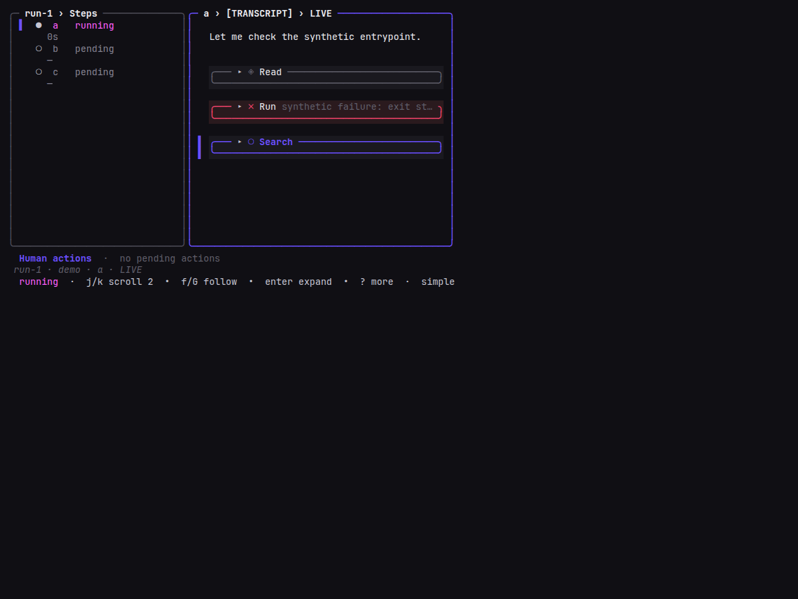

# Task 03 Proofs — Integrated Monitor selection affordance

## Task Summary

This task demonstrates that moving the transcript block cursor changes
only color and glyph — never the horizontal position of any content
(epic G3, spec G-03.a, FR-03.3). Two 80×24 Monitor frames are captured
against a fabricated fixture (`selectionVisualPage`, slice-03
proof-only): one with the cursor on a text row and one with the cursor
on a running tool-exchange card. The two frames are byte-identical
after stripping ANSI except for the two-cell leading gutter of the
selected item's rows (bar vs. two spaces).

## What This Task Proves

- Rows of unselected items keep their two-space gutter regardless of
  which item is selected; rows of the selected item carry the two-cell
  bar prefix (`▌ `) at the same visible column the unselected gutter
  occupies. Frames therefore do not shift when the cursor moves.
- Tool-exchange header cards render at exactly `transcriptInnerW` cells
  whether or not the item is selected (FR-03.5), so the slice-01 card
  cache no longer needs a per-selection width variant.
- `chatItemLineRanges` stays byte-identical across cursor positions
  (FR-03.4), so `n`/`N` block navigation and scroll-to-item cannot
  desynchronize when only the selection changes.
- The transcript items view sources its cursor glyph from
  `shared.CursorBar` (FR-03.2 / epic CC-7), aligning with the Steps
  panel and giving slice 14's glyph preset table a single point of
  control.
- Root build, `go vet ./...`, targeted TUI race, formatting, and
  whitespace checks pass. `go test ./...` retains pre-existing engine
  and harness failures documented under `25-task-3-limitations.md`;
  none are introduced by this slice.

## Evidence Summary

Both Monitor screenshots were produced from the production
`Model.View()` ANSI output using the fabricated slice-03 fixture. The
capture pipeline is production ANSI → deterministic test HTML → local
headless Chrome PNG, identical to slice-01 and slice-02. Fabricated
content only (paths, commands, status text); no `.jig/` data.

## Artifact: Selection off card (cursor on text row)

**What it proves:** With the cursor on the text item, all three tool
cards below sit in the same column position they occupy when the cursor
is elsewhere, and the text row shows the bar prefix. This is the
"before" scene of the parity comparison.

**Why it matters:** In the pre-fix behavior, moving the cursor onto a
card would slide it two columns right. This scene establishes the
baseline column positions of the three cards.

**Artifact path:**
`docs/specs/25-spec-selection-affordance/25-proofs/25-task-3-selection-off-card.png`

**Result summary:** Production Monitor capture at terminal 80×24 with
`transcriptInnerW=44`, text item (chatItems[0]) selected. The three
cards below render at their normal columns; the bar decorates the text
item's leading row.


## Artifact: Selection on card (cursor on running Search card)

**What it proves:** Moving the cursor down to the running tool card
places the bar on that card's top and bottom rows, and the two cards
above stay at exactly the same column positions they occupied when the
cursor was on the text row. Content does not shift horizontally.

**Why it matters:** This is the direct FR-03.3 demonstration. Pre-fix,
this same page would have sled the Search card two columns to the right
under selection; post-fix, the frame stays put.

**Artifact path:**
`docs/specs/25-spec-selection-affordance/25-proofs/25-task-3-selection-on-card.png`

**Result summary:** Production Monitor capture at terminal 80×24 with
`transcriptInnerW=44`, running Search card (chatItems[3]) selected. The
Read and Run cards above the selection are byte-identical (after
stripping ANSI) to the "off-card" scene; only the Search card's leading
two cells differ (bar vs. two spaces).



## Artifact: Capture metadata and reproducible sources

**What it proves:** Screenshot inputs, dimensions, and selection state
are recorded so reviewers can distinguish implementation evidence from a
hand-authored schematic.

**Artifact paths:**

- `25-task-3-selection-notes.txt`
- Matching `.ansi` production outputs and deterministic `.html` render
  inputs for each PNG.

**Command:**

```bash
JIG_UI_SNAPSHOT_DIR=/workspace/docs/specs/25-spec-selection-affordance/25-proofs \
  go test ./internal/tui/monitor -run '^TestSelectionAffordanceVisualProof$' -count=1 -v
```

**Result summary:** PASS. The proof test is intentionally skipped in
ordinary test runs and writes the ANSI/HTML artifacts (plus notes) only
when `JIG_UI_SNAPSHOT_DIR` is set to an absolute path.

## Artifact: Repository acceptance checks

**What it proves:** The completed implementation builds, and the
applicable correctness, static-analysis, race, formatting, and whitespace
gates pass.

**Commands and results** (captured under `25-task-3-acceptance/`):

| Check | Result | Artifact |
|---|---|---|
| `go build ./cmd/jig` | PASS | `build.txt` |
| `go vet ./...` | PASS | `vet.txt` |
| `go test -race ./internal/tui/...` | PASS across every TUI subpackage | `test-race-tui.txt` |
| `gofmt -l <changed-go-files>` | empty (formatted) | `gofmt.txt` |
| `git diff --check main HEAD -- internal/tui/monitor/` | PASS | `git-diff-check.txt` |
| `go test ./...` | FAIL (pre-existing engine/harness failures reproduce on `main`) | `test.txt`; see `25-task-3-limitations.md` |

## Reviewer Conclusion

Slice 03 ships Option A: the transcript block cursor now swaps a bar for
two spaces without shifting content. The two 80×24 captures visually
demonstrate the invariant, seven behavioral regressions
(`monitor_selection_affordance_test.go`) lock it in test, and the
applicable acceptance gates pass. `go test ./...` retains pre-existing
engine and harness failures documented under `25-task-3-limitations.md`;
none touch Monitor rendering.
