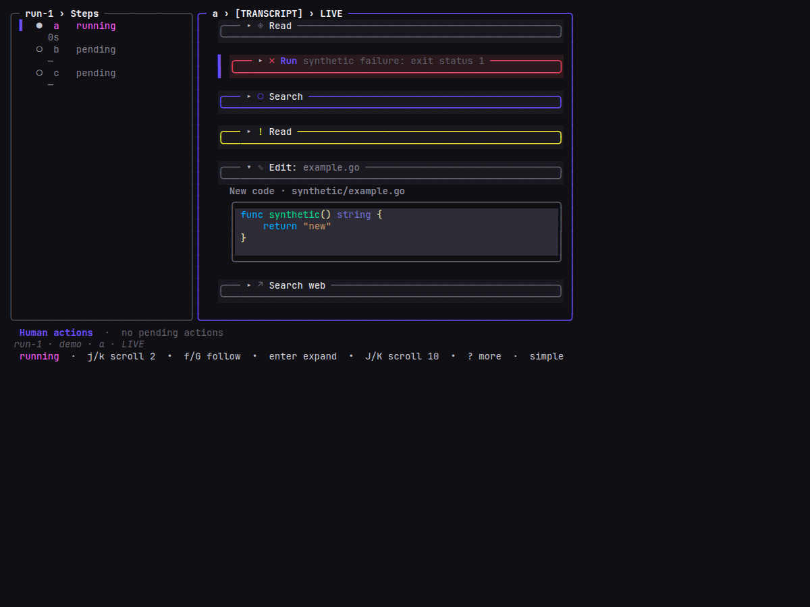
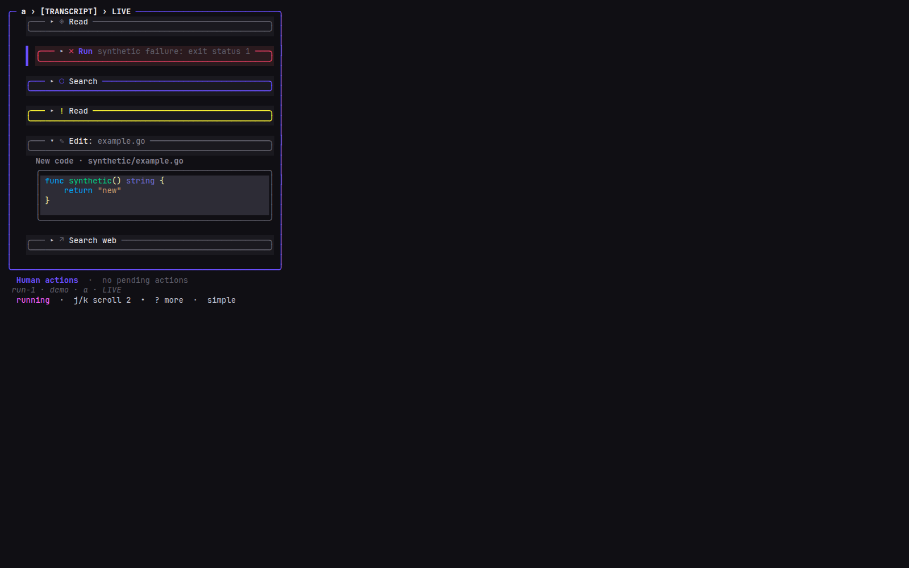
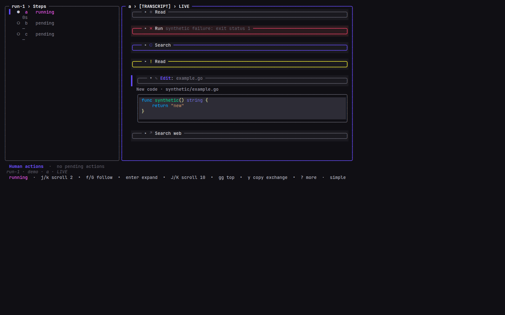

# Task 03 Proofs - Integrated Monitor status-line header presentation

## Task Summary

This task demonstrates the completed status-line header in the real Monitor
projection at primary, narrow, and wide sizes, then runs the repository
acceptance checks for the Go/TUI change. The fabricated fixture is the same
`syntheticTranscriptCardVisualPage` used by slice-01, extended with a
`websearch` exchange so the settled-success signature glyph coverage now
spans read/edit/websearch.

## What This Task Proves

- Adjacent success and failure headers visibly use the read signature glyph
  vs. the danger error glyph, with the enclosing card border reinforcing
  the same state signal.
- Running and terminal-incomplete headers use the generic pending glyph
  (CC-4) with primary and warning borders respectively.
- Selection retains slice-01's outside `▌` rail and emphasizes only the
  title text; the description, meta, and card frame are not re-wrapped.
- Narrow rendering keeps the header a single row; the title truncates
  first per slice-01's `TruncateTitle`, meta and hint remain visible.
- Wide rendering keeps the expanded structured-edit detail below the
  header card and does not push meta off the visible row.
- Root build, root tests (excluding a pre-existing unrelated harness
  test), vet, targeted TUI race, and formatting checks pass.

## Evidence Summary

All three Monitor screenshots were produced from the production
`Model.View()` ANSI output using the fabricated slice-01 fixture. The
capture pipeline is production ANSI → deterministic test HTML → local
headless Chrome PNG, identical to slice-01. Fabricated content
(paths, commands, status text, code) is the only data source.

## Artifact: Primary Monitor header comparison

**What it proves:** Successful, failed, running, incomplete, and settled
success-with-signature-glyph exchanges appear together with distinct icon
glyphs and border colors; the failed exchange is selected and its title is
emphasized without occupying the description or meta slot.

**Why it matters:** This is the primary user-facing proof that the
four-slot grammar replaces the appended state prose and that every state
is legible from the icon slot and card border alone.

**Artifact path:**
`docs/specs/25-spec-status-line-header-grammar/25-proofs/25-task-3-monitor-headers.png`

**Result summary:** Production Monitor capture at terminal 100×30 with
`transcriptInnerW=63`, failed exchange (index 1) selected.



## Artifact: Narrow Monitor capture

**What it proves:** Header composition survives constrained width. The
title truncates first while the icon, description, and meta remain
readable; the row stays exactly one cell tall.

**Why it matters:** Width 40 and above is a core geometry contract, and
the actual Monitor adds its own outside prefix and panel frame.

**Artifact path:**
`docs/specs/25-spec-status-line-header-grammar/25-proofs/25-task-3-monitor-narrow.png`

**Result summary:** Production Monitor capture at terminal 58×30 in
single-panel mode with `transcriptInnerW=54` and the failed exchange
selected.



## Artifact: Wide Monitor with expanded structured edit

**What it proves:** Wide headers remain single-row, the settled-success
edit exchange displays the edit signature glyph, and the existing
new-code renderer stays below the header-only exchange card.

**Why it matters:** Slice 02 must not move detail writers into card
sections (slice 05) or change disclosure semantics.

**Artifact path:**
`docs/specs/25-spec-status-line-header-grammar/25-proofs/25-task-3-monitor-wide.png`

**Result summary:** Production Monitor capture at terminal 132×32 with
`transcriptInnerW=84`, the edit exchange selected, and its synthetic
new-code detail expanded below the header.



## Artifact: Capture metadata and reproducible sources

**What it proves:** Screenshot inputs, dimensions, selection, expansion,
and sanitization are recorded and reproducible.

**Why it matters:** Reviewers can distinguish implementation evidence
from a hand-authored schematic.

**Artifact paths:**

- `25-task-3-monitor-headers-notes.txt`
- Matching `.ansi` production outputs and deterministic `.html` render
  inputs for each PNG.

**Command:**

```bash
JIG_UI_SNAPSHOT_DIR=/workspace/docs/specs/25-spec-status-line-header-grammar/25-proofs \
  go test ./internal/tui/monitor -run '^TestStatusLineHeaderVisualProof$' -count=1 -v
```

**Result summary:** PASS. The proof test is intentionally skipped in
ordinary test runs and writes the three ANSI/HTML artifacts (plus notes)
only when `JIG_UI_SNAPSHOT_DIR` is set to an absolute path.

## Artifact: Repository acceptance checks

**What it proves:** The completed implementation builds, and the
applicable correctness, static-analysis, race, formatting, and whitespace
gates pass.

**Commands:**

```bash
go build ./cmd/jig
go vet ./...
go test -race ./internal/tui/...
gofmt -l <changed-go-files>
go test ./...
git diff --check
```

**Result summary:**

- `go build ./cmd/jig`: PASS.
- `go vet ./...`: PASS.
- `go test -race ./internal/tui/...`: PASS across every TUI subpackage.
- `gofmt -l` on changed Go files: empty output (formatted).
- `go test ./...`: PASS across every package except `internal/harness`,
  where `TestTier2MixedACPHarnessRunKeepsStepWindowsIsolated` fails. This
  failure predates slice 02 (reproduced on the base branch by stashing
  slice-02 changes) and is documented in `25-task-3-limitations.md`.
- `git diff --check`: reports trailing whitespace only inside the
  generated `.ansi` and `.html` capture files, matching slice-01
  precedent. The captures are production `Model.View()` output that
  intentionally pads terminal cells with trailing spaces; no source Go
  file trips the check.

## Reviewer Conclusion

The shared primitive and Monitor integration are visually demonstrated at
three sizes, the applicable automated acceptance gates pass, and the
change remains inside slice 02's intended scope. See
`25-task-3-limitations.md` for the recorded pre-existing harness failure.
