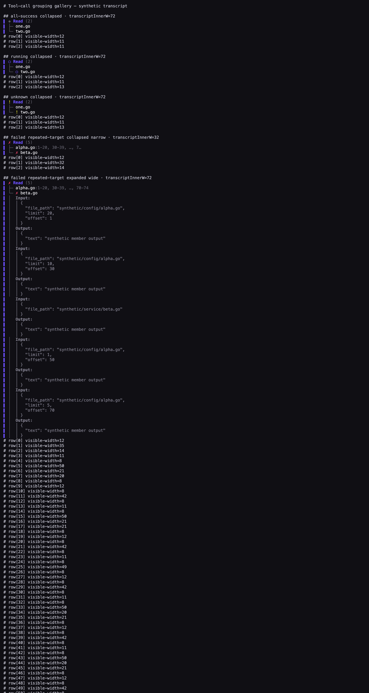

# Task 02 Proofs - Compact read tree and visible aggregate state

## Task Summary

This task renders grouped reads as a flat `Read (N)` tree. Full sanitized paths
own merge identity, compact path labels remain scannable, selectors merge in
first-seen order, and exceptional member state remains visible while collapsed.

## What This Task Proves

- FR-08.9–FR-08.10: the group uses shared status-line grammar and has no card
  chrome, with one row per distinct loaded target.
- FR-08.11–FR-08.13: target merging, selector de-duplication/elision, and
  fixed-three-cell shared tree prefixes are deterministic.
- FR-08.14–FR-08.16: successful rows stay quiet, exceptional state wins by
  precedence, and every synthetic rendered row is ANSI-safe and width-bounded.

## Evidence Summary

The focused Monitor/shared suite passed. A deterministic synthetic gallery was
captured with all-success, running, unknown, and failed aggregate states plus
repeated selectors at 32 and 72 content columns. The PNG was rendered from the
generated HTML by the local Chrome binary; no network or real transcript data
was used.

## Artifact: Focused renderer and shared-tree suite

**What it proves:** Count grammar, target order, selector handling, equal-width
connectors, state precedence, lack of card chrome, and narrow/wide bounds.

**Why it matters:** Operators can scan grouped reads without expanding them and
without losing failure visibility or terminal geometry.

**Command:**

```bash
go test ./internal/tui/monitor ./internal/tui/shared -run 'Test(ReadGroup|TreePrefix)' -count=1
```

**Result summary:** Both focused packages passed.

```text
ok  	jig/internal/tui/monitor	0.434s
ok  	jig/internal/tui/shared	0.649s
```

## Artifact: Synthetic read-group terminal gallery

**What it proves:** Collapsed groups expose success, running, unknown, and failed
state precedence; repeated targets remain legible at narrow width; and expanded
details remain ordered and bounded at wide width, with measured row widths.

**Why it matters:** This is reviewer-visible evidence of the actual rendered
shape rather than only structural assertions.

**Artifact paths:**

- `25-task-02-read-group-gallery.txt`
- `25-task-02-read-group-gallery.html`
- `25-task-02-read-group-gallery.png`

**Reproduction command:**

```bash
JIG_UI_SNAPSHOT_DIR=/absolute/path/to/docs/specs/25-spec-tool-call-grouping/25-proofs go test ./internal/tui/monitor -run TestReadGroupGallery -count=1
```

**Result summary:** Gallery generation and required local headless screenshot
capture passed. Proof generation fails if Chrome is unavailable or the
screenshot command fails, preventing a false-positive capture run.



## Reviewer Conclusion

The compact tree preserves every target and exceptional state, merges only by
full sanitized path, and stays within the Transcript panel width.
