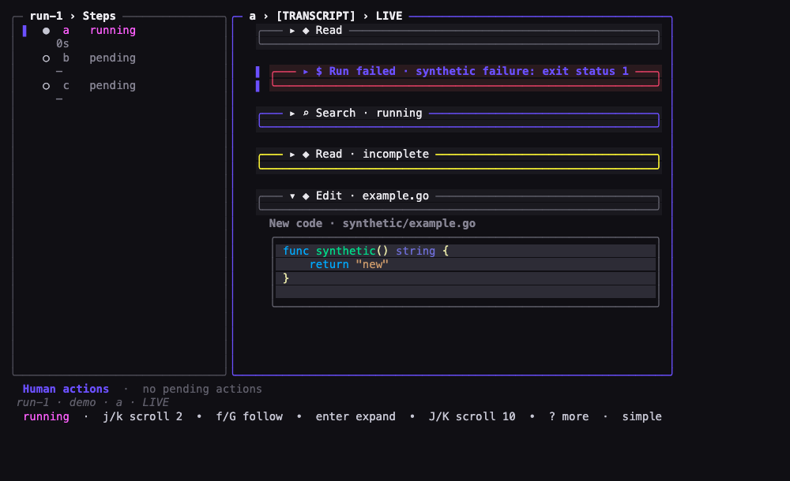
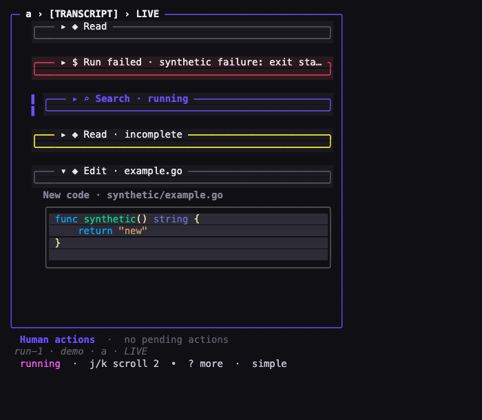
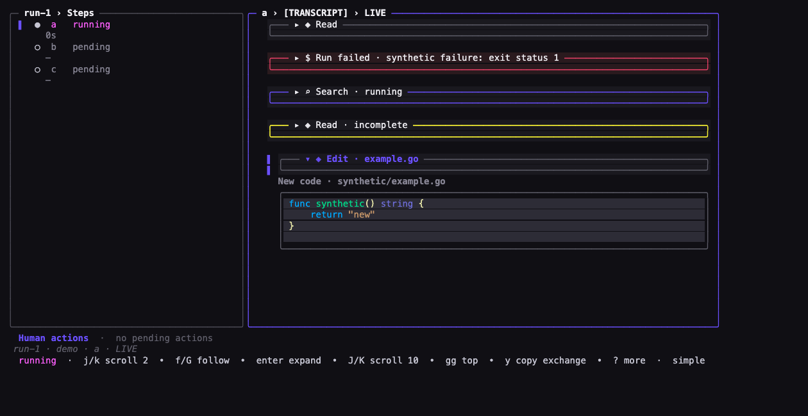

# Task 05 Proofs - Integrated Monitor states and acceptance gates

## Task Summary

This task demonstrates the completed card primitive in the real Monitor projection at primary, narrow, and wide sizes, then runs the repository acceptance checks for the Go/TUI change.

## What This Task Proves

- Adjacent success and failure cards visibly use quiet dim and prominent danger borders.
- Running and incomplete exchanges visibly use primary and warning borders.
- Selection retains an outside rail and emphasized label without replacing the state border.
- Narrow rendering shortens the failed header while retaining aligned rounded frames.
- Wide rendering keeps expanded structured-edit details below the two-row exchange header card.
- Root build, tests, vet, targeted TUI race tests, formatting, and whitespace checks pass.
- The final implementation remains inside slice 01's shared-card and exchange-header scope.

## Evidence Summary

All three screenshots were produced from the production `Model.View()` ANSI output using a deterministic fabricated page. Visual inspection caught and drove correction of a compositor color fallback before the final captures were regenerated. All automated acceptance gates then passed.

## Artifact: Primary Monitor state comparison

**What it proves:** Successful, failed, running, and incomplete exchanges appear together with distinct semantic borders; the failed exchange is selected without losing its danger border.

**Why it matters:** This is the primary user-facing proof that urgent tool activity stands out while successful work remains quiet.

**Artifact path:** `docs/specs/25-spec-transcript-card-primitive/25-proofs/25-task-5-monitor-states.png`

**Result summary:** Production Monitor capture at terminal 100×30 with `transcriptInnerW=63`, selected failed exchange index 1, `expandAll=false`, and the synthetic structured edit expanded.



## Artifact: Narrow Monitor capture

**What it proves:** Rounded card alignment and selection cues survive constrained width, and an overlong failed header shortens without overflowing.

**Why it matters:** Width 40 and above is a core geometry contract, and the actual Monitor adds its own outside prefix and panel frame.

**Artifact path:** `docs/specs/25-spec-transcript-card-primitive/25-proofs/25-task-5-monitor-narrow.png`

**Result summary:** Production Monitor capture at terminal 58×30 in single-panel mode with `transcriptInnerW=54` and the running exchange selected.



## Artifact: Wide Monitor with expanded structured edit

**What it proves:** Wide cards remain aligned and the existing new-code renderer stays below the header-only exchange card.

**Why it matters:** Slice 01 must not move detail writers into card sections or change disclosure semantics.

**Artifact path:** `docs/specs/25-spec-transcript-card-primitive/25-proofs/25-task-5-monitor-wide.png`

**Result summary:** Production Monitor capture at terminal 132×32 with `transcriptInnerW=84`, the edit exchange selected, and its synthetic new-code detail expanded below the header.



## Artifact: Capture metadata and reproducible sources

**What it proves:** Screenshot inputs, dimensions, selection, expansion, and sanitization are recorded and reproducible.

**Why it matters:** Reviewers can distinguish implementation evidence from a hand-authored schematic.

**Artifact paths:**

- `docs/specs/25-spec-transcript-card-primitive/25-proofs/25-task-5-monitor-states-notes.txt`
- Matching `.ansi` production outputs and deterministic `.html` render inputs for each PNG.

**Command:**

```bash
JIG_UI_SNAPSHOT_DIR=docs/specs/25-spec-transcript-card-primitive/25-proofs \
  go test ./internal/tui/monitor -run '^TestTranscriptCardVisualProof$' -count=1 -v
```

**Result summary:** PASS. The proof test is intentionally skipped during ordinary test runs when `JIG_UI_SNAPSHOT_DIR` is absent; with the capture variable set it writes all three sanitized ANSI and HTML artifacts.

## Artifact: Repository acceptance checks

**What it proves:** The completed implementation builds and passes the repository's applicable correctness, static-analysis, race, formatting, and whitespace gates.

**Why it matters:** Focused rendering tests do not replace whole-module regression checks.

**Commands:**

```bash
go build ./cmd/jig
go test ./...
go vet ./...
go test -race ./internal/tui/...
gofmt -l <changed-go-files>
git diff --check
```

**Result summary:** All commands passed. `gofmt -l` and `git diff --check` produced no output. Root tests passed across `cmd/jig` and all internal packages; the targeted race run passed all packages under `internal/tui/...`.

## Artifact: Final scope and disclosure review

**What it proves:** The final diff contains only the spec/task/proof artifacts, shared card/theme/compositor work, Monitor exchange rendering/cache integration, and their tests.

**Why it matters:** The epic deliberately assigns detail-card conversion, grouping, header grammar, and other presentation redesigns to later slices.

**Result summary:** No workflow storage, engine, harness, backend, dependency, schema, light-theme, grouping, alternate grammar, or detail-section conversion entered the change. A credential-pattern scan of the proof directory returned no matches. All captures use fabricated transcript content.

## Reviewer Conclusion

The shared primitive and Monitor exchange integration are visually demonstrated at three sizes, satisfy all automated acceptance gates, and remain within slice 01's intended scope.
