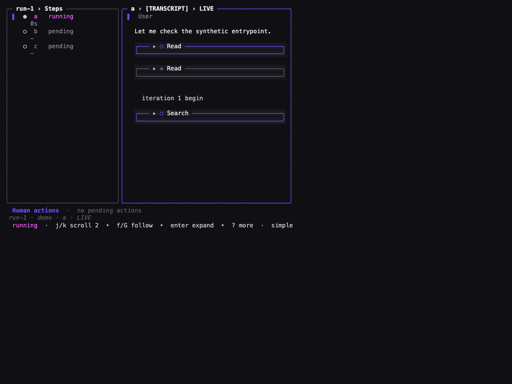

# Task 03 Proofs - Preserved Monitor fixtures and visual rhythm

## Task Summary

This task proves the vertical-rhythm refactor preserves the established transcript-card and selection-affordance contracts, keeps persistence-off behavior intact, and changes only the intended blank-line behavior in a deterministic 80×30 scene.

## What This Task Proves

- Existing card widths, prefixes, line ranges, paging, and cache bounds remain green without expectation changes.
- Persistence-off still builds no transcript items and shows the established empty state.
- A zero-height item leaves no ghost gap, structural edge blanks are removed, and the two-line coordinate boundary remains.
- The baseline is reproducible from pre-implementation commit `6b583fa` using a fixture-only patch in an isolated worktree.

## Evidence Summary

All preserved-fixture and persistence-off tests pass. The current and baseline ANSI captures differ, while both retain the same 29-row outer frame; the companion notes expose post-refactor item ranges and exact gaps for rapid review. Headless Chrome successfully produced the PNG from the deterministic HTML capture.

## Artifact: Preserved slice-01 and slice-03 fixtures

**What it proves:** Existing card and selection contracts remain unchanged.

**Why it matters:** The refactor must not weaken earlier slices' line-range, width, or cache guarantees.

**Artifact path:** `25-proofs/25-task-3-preserved-fixtures.txt`

**Result summary:** All named tests passed with package result `ok jig/internal/tui/monitor`.

## Artifact: Persistence-off regression

**What it proves:** Empty persistence roots still bypass item construction and render the established empty state.

**Why it matters:** Optional persistence must not turn an empty root into an unintended read or write path.

**Artifact path:** `25-proofs/25-task-3-persistence-off.txt`

**Result summary:** Both persistence-off tests passed with `EXIT=0`.

## Artifact: Baseline and current visual captures

**What it proves:** The same fabricated scene can be compared before and after the refactor, with the current capture documenting exact item ranges and inter-item gaps.

**Why it matters:** The visual delta is reviewable independently of the implementation.

**Artifact paths:**

- `25-proofs/25-task-3-baseline-harness.patch`
- `25-proofs/25-task-3-rhythm-baseline.ansi`
- `25-proofs/25-task-3-rhythm-baseline-notes.txt`
- `25-proofs/25-task-3-rhythm.ansi`
- `25-proofs/25-task-3-rhythm.html`
- `25-proofs/25-task-3-rhythm.png`
- `25-proofs/25-task-3-rhythm-notes.txt`

**Result summary:** The baseline patch applied and compiled at `6b583fa`; the baseline and current ANSI bytes differ (`cmp` exit 1), and both captures contain 29 terminal rows. Current notes show the skipped Seq=3 has no line range, ordinary gaps are one line, and the iteration boundary is two lines.

## Security Check

The fixture-only patch and captures use fabricated paths, IDs, content, and statuses. No real `.jig/` state or credentials are included.

## Reviewer Conclusion

Prior Monitor contracts and persistence-off behavior are preserved, while the intended zero-height and edge-spacing changes are observable against a reproducible baseline.
