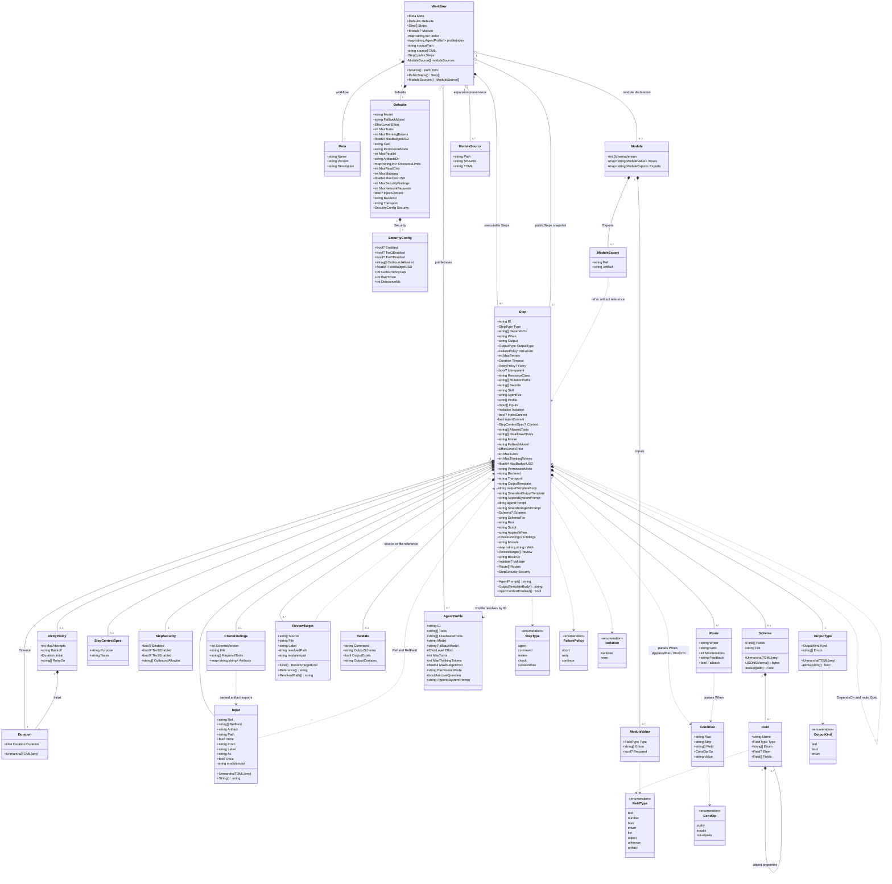

# Workflow object graph

This diagram describes the in-memory model produced by `internal/workflow`.
Solid diamonds indicate owned values. Dashed arrows indicate references encoded
as identifiers or strings rather than Go pointers.

## Reading the graph

- `Workflow.Steps` is the executable graph. When modules are expanded,
  `publicSteps` retains the original author-facing graph.
- `index` and `profileIndex` are derived lookup structures and are not decoded
  directly from TOML.
- `When`, `AppliesWhen`, `BlockOn`, and `Route.When` remain strings in the
  stored object. Validation parses them into temporary `Condition` values.
- Agent prompts and output templates are loaded eagerly and copied into
  snapshot fields so a resumed run does not depend on changed authoring files.
- An agent's effective output schema is `BaseSchema + Step.Schema`. The base
  always supplies `assumptions`, `confidence`, `issues`, `status`, and
  `summary`.
- A `subworkflow` step exists only in the author graph. Module expansion
  replaces it with namespaced executable steps such as
  `moduleID__internalStepID`.

## Sources

- [`internal/workflow/schema.go`](../internal/workflow/schema.go)
- [`internal/workflow/base_schema.go`](../internal/workflow/base_schema.go)
- [`internal/workflow/condition.go`](../internal/workflow/condition.go)
- [`internal/workflow/module.go`](../internal/workflow/module.go)
