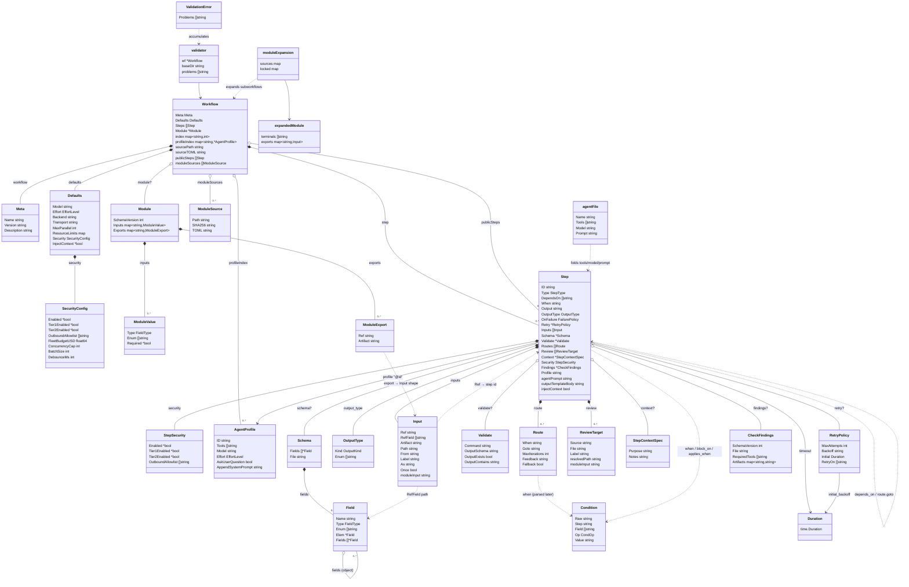
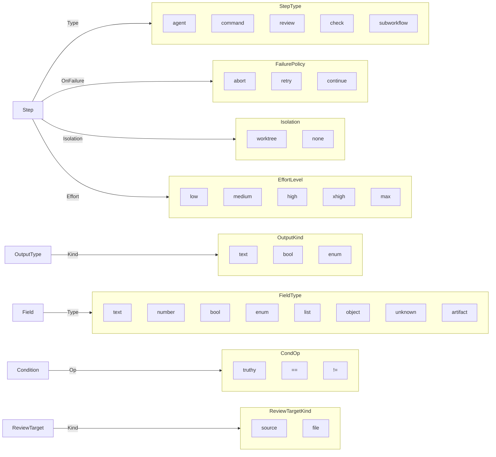
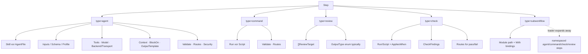
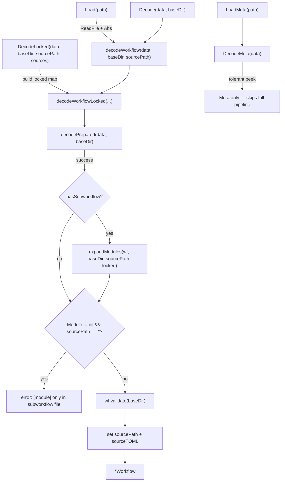
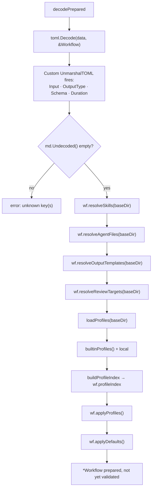
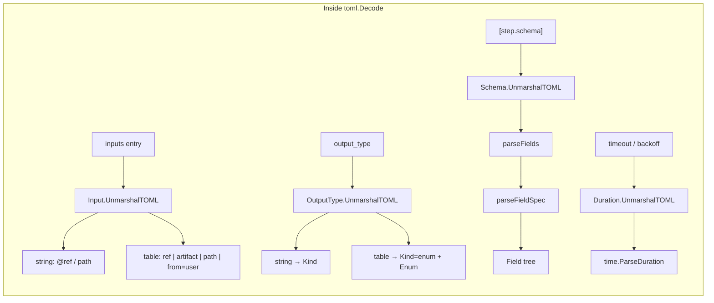
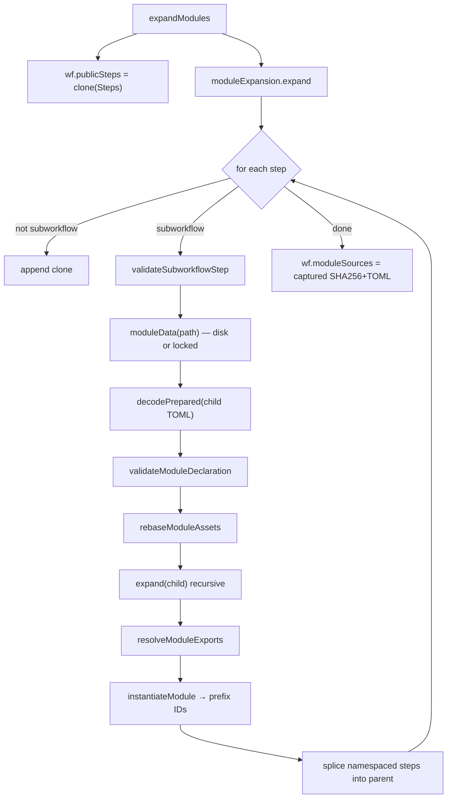
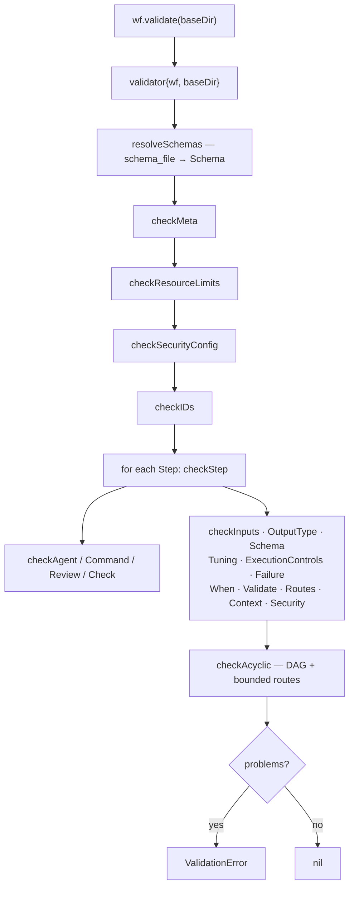

# `internal/workflow` object graph & TOML parse path

Maps every in-memory type in `internal/workflow` and the function call chain
that turns a `.toml` file into a validated `*Workflow`. Companion to
[`workflow-schema.md`](workflow-schema.md) (author-facing fields) and
[`ARCHITECTURE.md`](ARCHITECTURE.md) (package seams).

---

## 1. Detailed object dependency graph

Composition (owns / embeds) vs reference (points at by id or path). Unexported
fields are shown with a leading `_` so resume/snapshot state is visible.



### Ownership summary

| Owner | Owns / embeds | References by id / path |
|-------|---------------|-------------------------|
| `Workflow` | `Meta`, `Defaults`, `[]Step`, optional `Module`; runtime indexes | profiles by `"@id"`; module files via `ModuleSource` |
| `Defaults` | `SecurityConfig` | — |
| `Step` | `OutputType`, `[]Input`, `[]Route`, `[]ReviewTarget`, `StepSecurity`; optional `Schema`, `Validate`, `RetryPolicy`, `CheckFindings`, `StepContextSpec` | other steps via `DependsOn` / `Routes[].Goto`; profile via `Profile`; files via `Skill` / `AgentFile` / `SchemaFile` / `Script` / `OutputTemplate` / `Module` |
| `Schema` | tree of `Field` | — |
| `Field` | nested `Elem` / `Fields` | — |
| `Input` | — | producer step id + optional field path / artifact name |
| `Condition` | — | step id + optional field path (parsed from `when` strings) |

### Enums & named constants (leaf types)



### Per-step-type field clusters

Which nested objects matter for each `Step.Type` (validator enforces exclusivity):



---

## 2. TOML → `*Workflow` function diagram

Entry points and the ordered pipeline. Custom `UnmarshalTOML` methods fire
*inside* `toml.Decode`, before any of the resolve/default/validate stages.

### Top-level call graph



### `decodePrepared` — parse, resolve assets, inherit



**Inheritance precedence** (strongest → weakest) for agent knobs:

1. Explicit step TOML fields  
2. Values folded from `agent_file` / skill (tools, model, prompt)  
3. Referenced `AgentProfile` (`applyProfiles`)  
4. `[defaults]` then engine constants (`applyDefaults`)

`AskUserQuestion` from a profile is additive (always appends the tool).

### Custom TOML unmarshaling (during `toml.Decode`)



### Module expansion (when any step is `type = "subworkflow"`)



Nested modules call `decodePrepared` again (same asset/profile/default path),
then recurse `expand` before the parent finishes.

### `validate` — static checks after expansion



Guards (`when`, `route.when`, `applies_when`, `block_on`) are parsed with
`ParseCondition` inside the validator (and related checks), not during TOML
decode — so the grammar stays tiny and type-checked against the resolved graph.

### Side paths used by load / resume

| Function | Role |
|----------|------|
| `RestoreExpanded` | Rebuild a locked execution graph from a run snapshot (no module re-read); calls `applyDefaults` only |
| `ParseJSONSchema` / `Schema.JSONSchema` | Bidirectional bridge between `schema_file` JSON and internal `Field` trees |
| `MergedSchema` / `BaseSchema` | Overlay producer fields onto the engine base schema |
| `RepoRoot` / `ScriptPath` / `ExecutionPath` | Path anchors for command scripts and runtime resolution |
| `ParseAgentFileContent` | Public peek at agent-file model+prompt without a full workflow load |

### Ordered pipeline (one page)

```
.toml bytes
    │
    ▼
toml.Decode ──► UnmarshalTOML (Input, OutputType, Schema, Duration)
    │            reject undecoded keys
    ▼
resolveSkills / resolveAgentFiles / resolveOutputTemplates / resolveReviewTargets
    │
    ▼
loadProfiles + builtinProfiles → applyProfiles
    │
    ▼
applyDefaults (index, inheritance, isolation, inject_context, security fold)
    │
    ▼
[optional] expandModules → recursive decodePrepared + instantiate
    │
    ▼
validate (schemas, meta, ids, per-step, acyclic)
    │
    ▼
*Workflow { sourcePath, sourceTOML, Steps, publicSteps, moduleSources }
```
