# Workflow TOML parsing pipeline

This chart follows `Load`, `Decode`, and `DecodeLocked` from TOML input to a
fully resolved and validated `*workflow.Workflow`.

```mermaid
flowchart TD
    classDef entry fill:#e8f1ff,stroke:#4778b8,color:#17202a
    classDef transform fill:#f3edff,stroke:#7950a8,color:#17202a
    classDef decision fill:#fff4d6,stroke:#b48724,color:#17202a
    classDef external fill:#e8f7ef,stroke:#438a62,color:#17202a
    classDef failure fill:#fdeaea,stroke:#b74b4b,color:#17202a
    classDef result fill:#e6f5ff,stroke:#277da1,color:#17202a

    Load["Load(path)"]:::entry
    Decode["Decode(toml, baseDir)"]:::entry
    DecodeLocked["DecodeLocked(toml, baseDir, sourcePath, sources)"]:::entry

    ReadRoot["Read root .toml file<br/>Resolve absolute source path<br/>baseDir = workflow file directory"]:::external
    MakeLocked["Validate persisted ModuleSource records<br/>Normalize paths<br/>Build path to source map"]:::transform
    DecodeInternal["decodeWorkflowLocked(...)"]:::transform

    Load --> ReadRoot --> DecodeInternal
    Decode -->|"sourcePath empty; locked nil"| DecodeInternal
    DecodeLocked --> MakeLocked --> DecodeInternal

    subgraph PREPARE["Phase 1 — Decode and prepare the author graph"]
        TomlDecode["BurntSushi toml.Decode<br/>into a zero-value Workflow"]:::transform
        Custom["Custom TOML unmarshalling"]:::transform
        CU1["Duration<br/>string to time.Duration"]
        CU2["Input<br/>string/table to ref, field, artifact,<br/>path, or human-input form"]
        CU3["OutputType<br/>string/table to text, bool, or enum"]
        CU4["Schema<br/>nested TOML tables to sorted Field tree"]

        Unknown{"Any undecoded<br/>TOML keys?"}:::decision
        UnknownErr["Error: unknown workflow keys"]:::failure

        Skills["resolveSkills(baseDir)<br/>Read skill/SKILL.md<br/>Store prompt and snapshot"]:::external
        Agents["resolveAgentFiles(baseDir)<br/>Parse frontmatter and body<br/>Fill tools/model only when unset<br/>Store prompt snapshot"]:::external
        Templates["resolveOutputTemplates(baseDir)<br/>Read markdown body<br/>Store body and snapshot"]:::external
        Reviews["resolveReviewTargets(baseDir)<br/>Trim refs and resolve literal source paths"]:::transform

        Profiles["loadProfiles(baseDir)<br/>Read .agents/jig/profiles/*.toml<br/>Reject unknown keys, bad IDs,<br/>duplicates, and built-in shadowing"]:::external
        Builtins["builtinProfiles()<br/>@interactive and @autonomous"]:::transform
        ProfileIndex["Combine built-in and local profiles<br/>Build profileIndex"]:::transform
        ApplyProfiles["applyProfiles()<br/>Explicit step/agent-file values win<br/>Profile fills unset fields<br/>AskUserQuestion is additive"]:::transform

        Defaults["applyDefaults()"]:::transform
        DefaultDetails["Workflow defaults:<br/>max_parallel = 4<br/>artifacts_dir = .jig/artifacts<br/><br/>Step resolution:<br/>failure policy, retry count, output kind,<br/>model tuning, backend, transport,<br/>inject-context, security, isolation<br/><br/>Build step ID index"]:::transform

        Prepared["Prepared Workflow<br/>Not yet fully validated"]:::result

        TomlDecode -. invokes .-> Custom
        Custom --> CU1
        Custom --> CU2
        Custom --> CU3
        Custom --> CU4

        TomlDecode --> Unknown
        Unknown -->|yes| UnknownErr
        Unknown -->|no| Skills
        Skills --> Agents --> Templates --> Reviews --> Profiles
        Builtins --> ProfileIndex
        Profiles --> ProfileIndex --> ApplyProfiles --> Defaults
        Defaults --> DefaultDetails --> Prepared
    end

    DecodeInternal --> TomlDecode

    HasModule{"Any Step.Type<br/>subworkflow?"}:::decision
    Prepared --> HasModule

    subgraph EXPAND["Phase 2 — Recursively expand modules"]
        SavePublic["Clone author Steps into publicSteps"]:::transform
        NextModule["For each subworkflow step"]:::transform
        CheckInvocation["Validate invocation fields<br/>Require relative in-tree module path<br/>Detect recursive module cycles"]:::decision
        ModuleBytes["Read module TOML<br/>or use locked TOML after SHA-256 check"]:::external
        ChildPrepare["decodePrepared(child TOML,<br/>child directory)"]:::transform
        ChildDecl["Require and validate module declaration<br/>schema version, inputs, exports"]:::decision
        Rebase["Rebase child skill, agent-file,<br/>template, and schema paths<br/>Record ModuleSource provenance"]:::transform
        Nested{"Child contains<br/>subworkflows?"}:::decision
        Recursive["Recursively expand child"]:::transform
        ResolveExports["Resolve nested exports<br/>Validate exported fields and artifacts"]:::transform
        BindInputs["Instantiate module inputs<br/>Check required inputs and types<br/>Replace @module.name placeholders"]:::transform
        Namespace["Clone internal steps<br/>Prefix IDs and internal references<br/>moduleID__stepID"]:::transform
        Rewrite["Rewrite parent graph:<br/>module dependencies to terminal steps<br/>export refs to actual producers<br/>conditions, inputs, reviews, feedback,<br/>and implicit dependencies"]:::transform
        Reapply["Replace Workflow.Steps<br/>Reapply defaults and rebuild index<br/>Store sorted moduleSources"]:::transform

        ExpansionErr["Error: invalid module path, cycle,<br/>binding, export, checksum, or child TOML"]:::failure

        SavePublic --> NextModule --> CheckInvocation
        CheckInvocation -->|invalid| ExpansionErr
        CheckInvocation -->|valid| ModuleBytes --> ChildPrepare --> ChildDecl
        ChildDecl -->|invalid| ExpansionErr
        ChildDecl -->|valid| Rebase --> Nested
        Nested -->|yes| Recursive --> ResolveExports
        Nested -->|no| ResolveExports
        ResolveExports --> BindInputs --> Namespace --> Rewrite --> Reapply
    end

    HasModule -->|yes| SavePublic
    HasModule -->|no| TopModule
    Reapply --> TopModule

    TopModule{"Decoded from text without a source path<br/>but declares a module?"}:::decision
    TopModuleErr["Error: module declarations require<br/>a subworkflow file"]:::failure
    TopModule -->|yes| TopModuleErr
    TopModule -->|no| ValidateAll

    subgraph VALIDATE["Phase 3 — Resolve remaining schemas and validate"]
        ValidateAll["Workflow.validate(baseDir)"]:::transform
        ResolveSchemas["For each schema_file:<br/>read JSON Schema<br/>ParseJSONSchema to Schema/Field tree<br/>assign Step.Schema and Schema.File"]:::external

        Checks["Accumulate all validation problems"]:::transform
        C1["Workflow checks<br/>metadata, non-empty steps,<br/>parallelism and budget bounds"]
        C2["Global configuration checks<br/>resource limits and security settings"]
        C3["Identity checks<br/>valid and unique step IDs"]
        C4["Per-step type checks<br/>agent, command, review, check<br/>reject cross-type fields"]
        C5["Reference and contract checks<br/>depends_on, inputs, fields, artifacts,<br/>profiles, schemas, conditions"]
        C6["Execution-policy checks<br/>timeouts, retry/idempotence, mutation paths,<br/>backend/transport, failure policy"]
        C7["Gate and loop checks<br/>validate blocks, applicability,<br/>routes, fallbacks, bounded back-edges"]
        C8["Graph check<br/>DFS over depends_on must be acyclic<br/>bounded route back-edges are excluded"]

        Problems{"Any accumulated<br/>problems?"}:::decision
        ValidationErr["Sort problems<br/>Return ValidationError"]:::failure

        ValidateAll --> ResolveSchemas --> Checks
        Checks --> C1
        Checks --> C2
        Checks --> C3
        Checks --> C4
        Checks --> C5
        Checks --> C6
        Checks --> C7
        Checks --> C8
        C1 --> Problems
        C2 --> Problems
        C3 --> Problems
        C4 --> Problems
        C5 --> Problems
        C6 --> Problems
        C7 --> Problems
        C8 --> Problems
        Problems -->|yes| ValidationErr
    end

    Finalize["Attach sourcePath and original sourceTOML"]:::transform
    Result["Return fully resolved *Workflow<br/><br/>Steps = executable graph<br/>publicSteps = author graph when expanded<br/>index/profileIndex populated<br/>prompts/templates snapshotted<br/>module provenance captured"]:::result

    Problems -->|no| Finalize --> Result

    FileSkip["When baseDir is empty:<br/>authoring-file reads and existence checks<br/>are skipped for structural-only decoding"]:::external
    Decode -. mode .-> FileSkip

    UnknownErr --> Failed["Return error; no Workflow"]:::failure
    ExpansionErr --> Failed
    TopModuleErr --> Failed
    ValidationErr --> Failed
```



## Configuration precedence

For fields that use zero-value inheritance, the loader applies this precedence:

```text
explicit [[step]] value
    > value loaded from agent_file
    > referenced AgentProfile
    > [defaults]
    > built-in fallback
```

Notable exceptions and details:

- A skill supplies only the resolved instruction body. An agent file may also
  supply tools and a model.
- `AskUserQuestion` from the `@interactive` profile is additive, even when the
  step already has an explicit tool allowlist.
- `inject_context` uses pointer booleans so an explicit `false` is different
  from an omitted value.
- Agent steps using mutating tools default to `worktree` isolation. Other steps
  default to `none`.
- Cursor and Codex default to the ACP transport. Claude defaults to the SDK
  transport unless configured otherwise.

## Entry-point behavior

| Entry point | Source | File checks | Module source behavior |
|---|---|---|---|
| `Load(path)` | Reads TOML from disk | Enabled | Reads current module files |
| `Decode(data, baseDir)` | Receives TOML text | Enabled when `baseDir != ""` | Reads current module files |
| `Decode(data, "")` | Receives TOML text | Skipped | Cannot expand modules |
| `DecodeLocked(...)` | Receives persisted TOML | Enabled according to `baseDir` | Requires captured module TOML and verifies its SHA-256 |

## Sources

- [`internal/workflow/load.go`](../internal/workflow/load.go)
- [`internal/workflow/agent_file.go`](../internal/workflow/agent_file.go)
- [`internal/workflow/skill.go`](../internal/workflow/skill.go)
- [`internal/workflow/load_profiles.go`](../internal/workflow/load_profiles.go)
- [`internal/workflow/module.go`](../internal/workflow/module.go)
- [`internal/workflow/validate.go`](../internal/workflow/validate.go)
- [`internal/workflow/schema_json.go`](../internal/workflow/schema_json.go)
